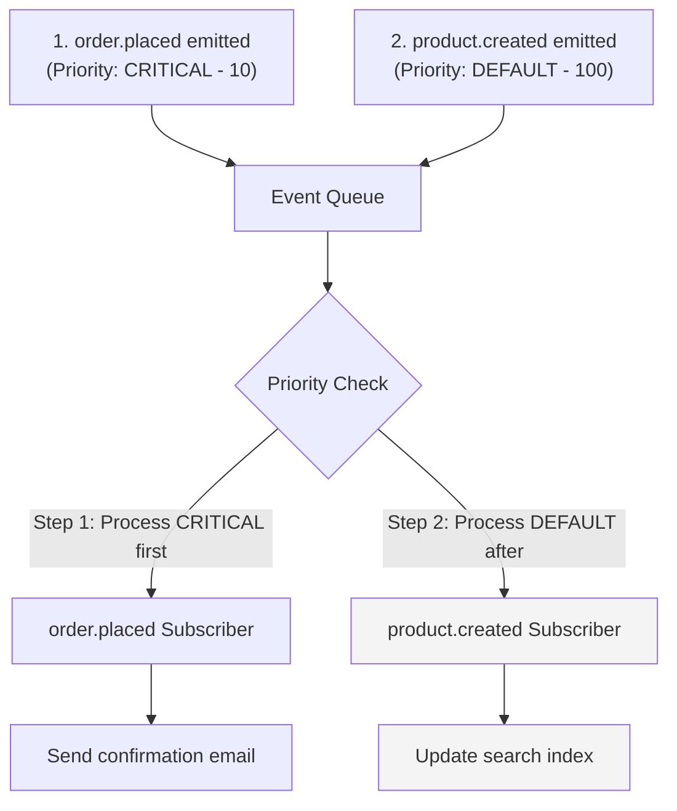

import { Table } from "docs-ui"

export const metadata = {
  title: `Event Processing Priority`,
}

# {metadata.title}

<Note>

Priority-based event processing is available since [Medusa v2.13.0](https://github.com/medusajs/medusa/releases/tag/v2.13.0).

</Note>

## How Event Priority Works

Medusa uses a priority queue system for event processing to ensure that critical business events are processed first. This improves system responsiveness and prevents internal operations from blocking customer-facing functionality.

For example, if you're adding a large number of products to the catalog, and a user places an order at the same time, Medusa will prioritize processing the `order.placed` event and its subscribers before handling the product addition events.



In this example, even though both events are emitted around the same time, Medusa processes the `order.placed` event (priority 10) before the `product.created` event (priority 100), ensuring the customer receives their order confirmation promptly.

---

## Event Priority Levels

Events are assigned a priority level that determines their processing order. Lower numbers indicate higher priority and are processed first.

<Table>
  <Table.Header>
    <Table.Row>
      <Table.HeaderCell>
        Priority Level (Numeric Value)
      </Table.HeaderCell>
      <Table.HeaderCell>
        Description
      </Table.HeaderCell>
    </Table.Row>
  </Table.Header>
  <Table.Body>
    <Table.Row>
      <Table.Cell>
        `CRITICAL` (10)
      </Table.Cell>
      <Table.Cell>
        Highest priority for critical business events. Medusa uses this for the order placement event.
      </Table.Cell>
    </Table.Row>
    <Table.Row>
      <Table.Cell>
        `HIGH` (50)
      </Table.Cell>
      <Table.Cell>
        High priority for important operations. For example, you can assign this priority to customer account-related events.
      </Table.Cell>
    </Table.Row>
    <Table.Row>
      <Table.Cell>
        `DEFAULT` (100)
      </Table.Cell>
      <Table.Cell>
        The default priority used if no specific priority is assigned. All Medusa business events except for order placement use this priority.
      </Table.Cell>
    </Table.Row>
    <Table.Row>
      <Table.Cell>
        `LOW` (500)
      </Table.Cell>
      <Table.Cell>
        Low priority for background operations. For example, you can assign this priority to third-party sync events.
      </Table.Cell>
    </Table.Row>
    <Table.Row>
      <Table.Cell>
        `LOWEST` (2,097,152)
      </Table.Cell>
      <Table.Cell>
        Lowest priority. Medusa assigns this to internal system events.
      </Table.Cell>
    </Table.Row>
  </Table.Body>
</Table>

---

## Emit Events with Custom Priority

When emitting custom events in your application, you can specify a priority level to control when the event is processed relative to other events in the queue.

For example, to emit a `payment.processed` event with `CRITICAL` priority in a custom workflow:

export const emitHighlights = [
  ["14", "priority", "Set the event priority to CRITICAL."]
]

```ts title="src/workflows/handle-payment.ts" highlights={emitHighlights}
import { createWorkflow, WorkflowResponse } from "@medusajs/framework/workflows-sdk"
import { emitEventStep } from "@medusajs/medusa/core-flows"
import { EventPriority } from "@medusajs/framework/utils"

export const handlePaymentWorkflow = createWorkflow(
  "handle-payment",
  (input: { paymentId: string }) => {
    emitEventStep({
      eventName: "payment.processed",
      data: {
        id: input.paymentId
      },
      options: {
        priority: EventPriority.CRITICAL
      }
    })

    return new WorkflowResponse({ success: true })
  }
)
```

You pass the priority level in the `options` parameter of the `emitEventStep`. You can use the `EventPriority` enum to specify the desired priority:

- `EventPriority.CRITICAL` (10): For critical business events.
- `EventPriority.HIGH` (50): For high-priority operations.
- `EventPriority.DEFAULT` (100): The default priority level. If you don't specify a priority, this level is used.
- `EventPriority.LOW` (500): For low-priority background tasks.
- `EventPriority.LOWEST` (2,097,152): For the lowest priority events like internal system operations.

---

## When to Emit Events with Custom Priority

Specify a custom priority for your custom events based on their importance to your business operations:

- **Critical business operations**: Events that directly impact customer experience. For example, payment processing or order fulfillment.
- **High-priority integrations**: Real-time syncs with external systems that customers depend on, such as inventory management or CRM updates.
- **Low-priority background tasks**: Cleanup operations, analytics processing, or batch jobs that can be deferred. For example, syncing data to a data warehouse.

If you're unsure about the priority level to assign, don't assign a custom priority. Medusa will use the `DEFAULT` priority level, which is suitable for most use cases.
