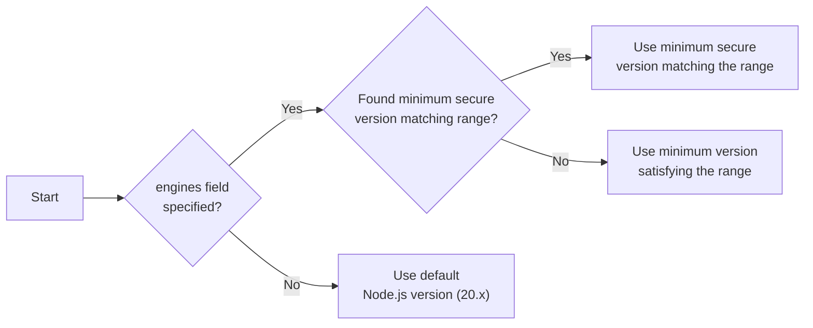

export const metadata = {
  title: `Prerequisites for New Projects`,
}

# {metadata.title}

In this guide, learn about the prerequisites for your Medusa application and storefront before deploying it to Cloud in a new project.

Alternatively, you can create a project from a starter, as explained in the [Create Projects](../page.mdx) guide.

## Who is this guide for?

This guide is intended for developers and teams deploying their local Medusa applications to Cloud.

You'll learn what setup steps are necessary for:

1. Deploying a Medusa application (server and admin dashboard) only;
2. Or deploying a Medusa application along with a storefront.

---

## Prerequisites for Medusa Application

This section covers the prerequisites for deploying your Medusa application (server and admin dashboard) to Cloud.

If you're also deploying a storefront with your backend, check the [next section](#prerequisites-for-medusa-application-with-storefront) for additional prerequisites.

### Supported Node.js Versions

Medusa supports the Node.js LTS of the following major versions:

- 20.x (default)
- 22.x
- 24.x
- 25.x

#### Specifying Node.js Version

You can override the default Node.js version for your Medusa application by adding an `engines` field in your `package.json` file:

```json title="package.json"
{
  "engines": {
    "node": ">=22.0.0"
  }
}
```

Medusa will satisfy this version by the following priority:



1. Find the minimum secure version that matches the range specified in the `engines` field. For example, if your `package.json` specifies `>=21.0.0`, Medusa will use Node.js v22.x since v21.x is no longer supported.
2. If Medusa can't find the minimum secure version that matches the range, it will use the minimum version that satisfies the range, even if it's not an LTS version.
3. If no `engines` field is specified, Medusa will use the default Node.js version (20.x).

### Configurations Managed in Cloud

Your existing Medusa application (server and admin dashboard) doesn't need specific configurations to be deployed to Cloud. Medusa automatically:

- Creates the necessary [server and worker instances](!docs!/learn/production/worker-mode).
- Scales your Medusa application's resources based on the traffic it receives.
- Sets up and configures production resources and modules for your Medusa application:
    - [Redis Caching Module Provider](!resources!/infrastructure-modules/caching/providers/redis)
    - [Redis Event Module](!resources!/infrastructure-modules/event/redis)
    - [Redis Locking Module Provider](!resources!/infrastructure-modules/locking/redis)
    - [Redis Workflow Engine Module](!resources!/infrastructure-modules/workflow-engine/redis)
    - [S3 File Provider Module](!resources!/infrastructure-modules/file/s3)

Make sure to remove any of these modules from your `medusa-config.ts` file unless you want to use custom options for them. In that case, you must manually set up and manage those resources externally and configure them in your Medusa application.

<Note>

The Caching Module was introduced in [Medusa v2.11.0](https://github.com/medusajs/medusa/releases/tag/v2.11.0) to replace the deprecated Cache Module. If you're still using the Cache Module, make sure to remove it from your `medusa-config.ts` file as well.

</Note>

---

## Prerequisites for Medusa Application with Storefront

This section covers the prerequisites for deploying your Medusa application (server and admin dashboard) along with a storefront to Cloud.

Make sure to follow these steps in addition to the ones mentioned in the [previous section](#prerequisites-for-medusa-application-only).

<Note type="soon">

Storefront deployment is an experimental feature, and our team is actively working on enhancing it. If you run into any issues, contact support for assistance.

</Note>

### Monorepo Setup

To deploy your Medusa application along with a storefront, both projects must be set up in a monorepo structure.

To create a monorepo, you need:

1. Package manager: Cloud supports `npm`, `yarn` (v1, v3, and v4), and `pnpm` as package managers.
2. Monorepo tool: You can use [turbo](https://turborepo.com/) or [nx](https://nx.dev/) to manage your monorepo.

You can structure your monorepo as you see fit. You'll be required to specify the paths to your Medusa application and storefront during the project creation process on Cloud.


### Storefront Supported Node.js Versions

Medusa uses Node.js v24.x (LTS) to build storefronts. You can't override this version.

So, ensure that your storefront is compatible with Node.js v24.x.

### Root Build Script

Your monorepo must have a `build` script that builds both the Medusa application and the storefront. Medusa executes this script during the deployment process.

For example, if you're using `turbo`, you should have the following script in your root `package.json` file:

```json title="package.json"
{
  "scripts": {
    "build": "turbo run build"
    // other scripts...
  }
}
```

### Prerequisites for Yarn Workspaces

If you're using `yarn` as your package manager, create the `.yarnrc.yml` file in the root of your monorepo with the following content:

```yaml title=".yarnrc.yml"
nodeLinker: node-modules

nmHoistingLimits: workspaces
```

You set the following configurations:

1. `nodeLinker: node-modules`: Configures Yarn to install dependencies using the traditional `node_modules` structure, which is required for Medusa applications.
2. `nmHoistingLimits: workspaces`: Ensures that dependencies are hoisted only to the workspace level, preventing potential conflicts between packages in the monorepo.

{/* ### Prerequisites for PNPM Workspaces

If you're using `pnpm` as your package manager, set up the following configurations in your monorepo.

First, create the `.npmrc` file in the root of your monorepo with the following content:

```text title=".npmrc"
auto-install-peers=true
strict-peer-dependencies=false
shared-workspace-lockfile=false
```

You set the following configurations:

1. `auto-install-peers=true`: Ensures that peer dependencies are automatically installed when you install packages, preventing potential issues with missing peer dependencies.
2. `strict-peer-dependencies=false`: Allows more flexibility when resolving peer dependencies, which can be helpful in a monorepo setup.
3. `shared-workspace-lockfile=false`: Ensures that each package in the monorepo can have its own lockfile, which is necessary for Medusa to resolve dependencies correctly.

Next, create the `pnpm-workspace.yaml` file in the root of your monorepo with the following content:

```yaml title="pnpm-workspace.yaml"
packages:
  - "apps/**"
  - "!apps/backend/.medusa/**"
```

This configuration specifies the packages that are part of your pnpm workspace. The example above includes all packages under the `apps` directory, except for the `.medusa` directory within the `backend` package.

Finally, add the `.npmrc` file to your Medusa application's root directory if it doesn't already exist, with the following content:

```text title="apps/backend/.npmrc"
public-hoist-pattern[]=*@medusajs/*
public-hoist-pattern[]=@tanstack/react-query
public-hoist-pattern[]=react-i18next
public-hoist-pattern[]=react-router-dom
```

This configuration ensures that specific dependencies are hoisted to the root `node_modules` directory, which is necessary for Medusa to function correctly. */}

### Prerequisites for NPM Workspaces

If you're using `npm` as your package manager, and you're using the [Next.js Starter Storefront](!resources!/nextjs-starter) as your storefront, add the following override in the storefront's `package.json`:

```json title="apps/storefront/package.json"
{
  "overrides": {
    // other overrides...
    "@medusajs/icons": {
      "react": "19.0.3",
      "react-dom": "19.0.3"
    }
  }
}
```

This ensures the `@medusajs/icons` package uses compatible versions of `react` and `react-dom` with the Next.js Starter Storefront.

Also, add the following override in your monorepo's root `package.json`:

```json title="package.json"
{
  "overrides": {
    // other overrides...
    "react": "19.0.3",
    "react-dom": "19.0.3"
  }
}
```

This ensures that all packages in your monorepo use compatible versions of `react` and `react-dom`.

### Supported Storefront Frameworks

Cloud currently supports deploying storefronts built with the following frameworks:

1. [Next.js](https://nextjs.org/) v15
2. [SvelteKit](https://kit.svelte.dev/) v2.40.0+
3. [Tanstack Start](https://tanstack.com/start) v1.132.0+

If you're using a different framework for your storefront, contact support to request it.

---

## Additional Storefront Considerations

When deploying your storefront to Cloud, there are additional considerations to keep in mind related to the build process, environment variables, and custom domains.

Refer to the [Storefront](../../storefront/page.mdx) guide for more details on these considerations.

---

## Next Steps

Now that you know the prerequisites for deploying your Medusa application and storefront to Cloud, you can create your project.

Refer to the [Project](../page.mdx) guide to learn how to create a new project on Cloud.